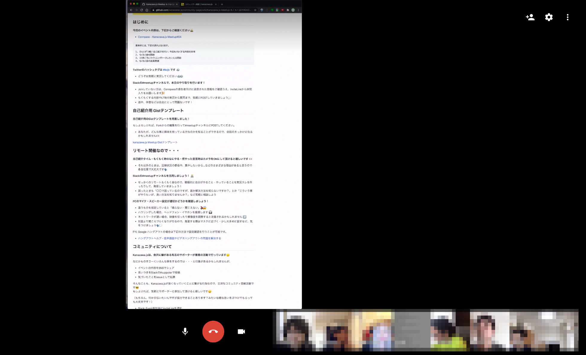
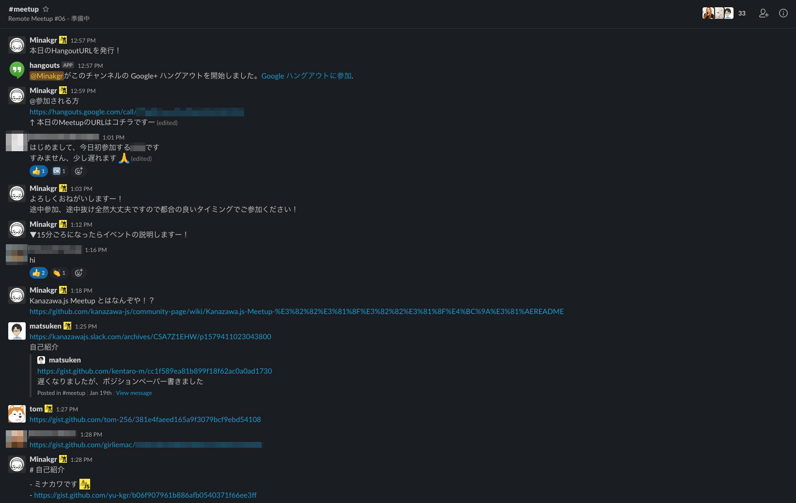
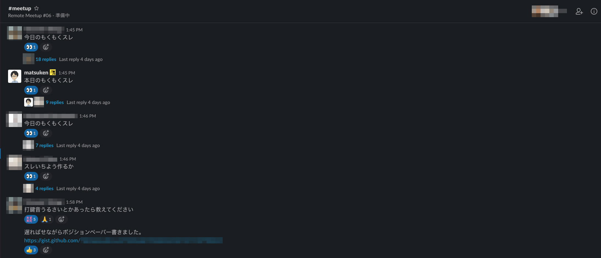
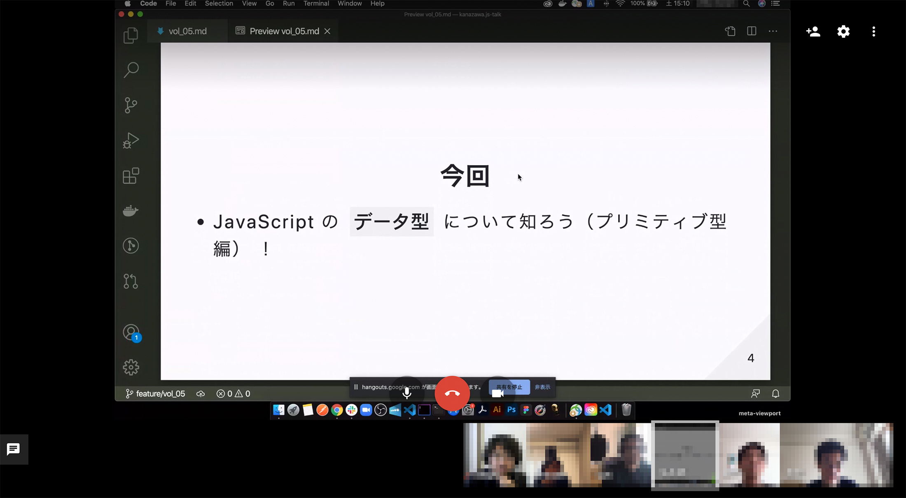
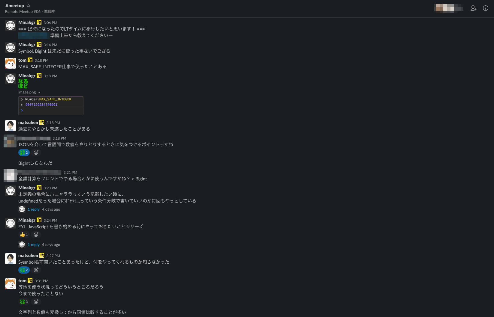

どうもこんにちわ。Kanazawa.jsサポーターの [@yu_kgr](https://twitter.com/yu_kgr)です。

まだ参加されたことがない方に向けて `イベント中の様子がちょっとでも伝わればいいなぁ` という思いつきからレポートを作成してみました。

利用するリモートコミュニケーションツールが毎度変更されるひとに定評がある"kzjs"ですが、今回はGoogleのhangoutとSlackを活用してリモートMeetupを実施しました。

 

#### イベント中の様子

今回は6-7名ほどの参加。異なるタイムゾーンから遊びに来てくれた方もいました。  
（kzjsは途中参加・途中離脱なんでもごされ。異なるタイムゾーンでもウエルカムです）

イベント概要やコミュニティについて雑に説明する図 `※念の為、モザイクかけてます`  
（縦の長い画面ですが、スマホとかじゃなくて単純に縦向きにしてるディスプレイです）

Slackで自己紹介をする参加者たちの図 `※サポーター以外は念の為、モザ(ry`  
（口頭の説明だけだと忘れちゃうので自己紹介シートを貼り付けるスタイル）

もくもく開始。各々もくもくスレを作って実況し始める図 `※サポーター以外h(ry`  
（各々勝手に人のスレをチラ見しつつemojiを残したり茶々をいれます）

LT発表タイム。画面共有でLT参加者の発表を聞く参加者たち `※全員モz(ry`  
（今回はJavaScriptのデータ型について掘り下げるLTが発表されました）

LTを聞きながら、思い思いの反応を実況する参加者たち `※モ(ry`  
（ちなみにこのあと、飛び込みLTでGraphQLについてひたすら説明するおじさんが出現しました）

 

#### 所感

今回は参加人数が `ピザ2枚ルール` に収まるような人数だったので雑談しながらもくもくしたり、  
LTに対するリアクションを返したりできるゆるやかな雰囲気でした。

（人数が増えた場合、まだまだリモートにおけるファシリテートは慣れてないため、ぶっつけ本番ぶつかり稽古となりそうですが生暖かい目で見守っていただければと思います）

ちなみに次回以降は、Zoomのブレイクアウトルームを活用した懇親会なども考えているので、  
このレポートを見て「なんかゆるそうだから、一度参加してみようかなぁ」なんて思っていただければ幸いです。

ではでは。
