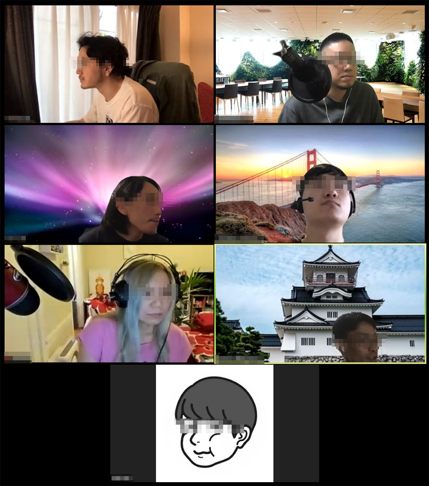
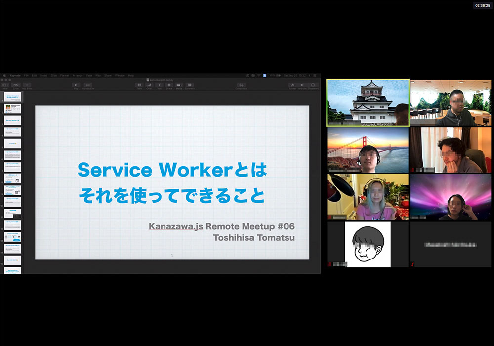
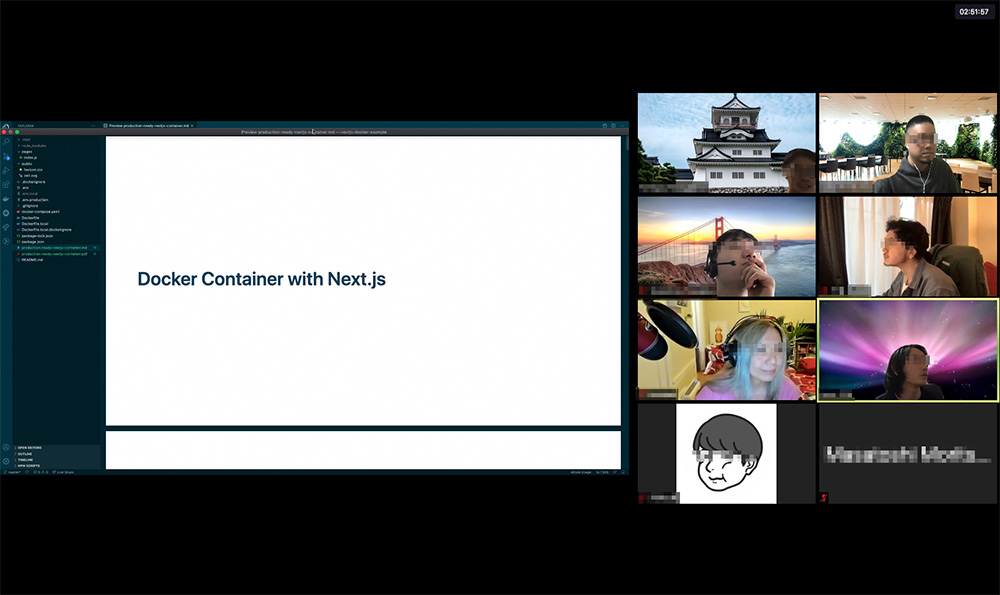
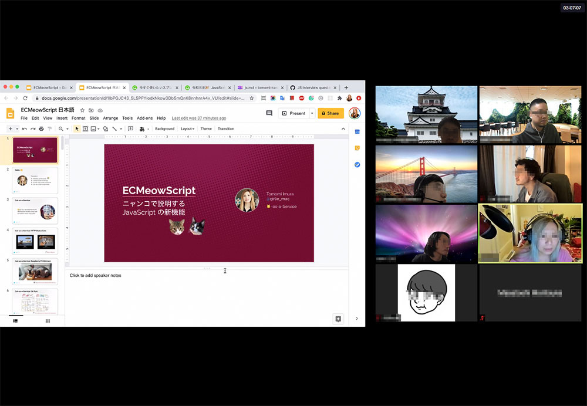

こんにちは。Kanazawa.jsサポーターの[@_kentaro_m](https://twitter.com/_kentaro_m)です。

9月26日に開催した[Kanazawa.js Remote Meetup #06](https://kanazawajs.connpass.com/event/188109/)の模様をお伝えしたいと思います。

#### イベント中の様子
今回のMeetupは8人の方に参加いただきました。Google MeetやSlackなどで参加者同士のコミュニケーションをとり、賑やかな会となりました。

もくもく会ではJavaScriptの言語仕様の深堀りやLT発表の準備、Slackでの技術雑談など、参加者は各自作業を行っていました。

LTは4本の発表がありました。

1本目はtoshi-tomaさんによる「[Service Workerとは、それを使ってできること / what-is-service-worker](https://speakerdeck.com/10shi10ma/what-is-service-worker)
」でした。Service Workerの概要と活用事例の説明が非常に分かりやすかったです。

2本目はtom-256さんによる「Docker Container with Next.js」でした。Next.jsをコンテナで動作させる際に考慮したポイントについてお話しいただきました。

3本目はTomomi Imuraさんによる「[ECMeowScript 日本語 #1 ES6 - Google スライド](https://docs.google.com/presentation/d/1Jh5OwsrGHMLkL1lEA0558md5OmVOFB0g_2QAUiswoRg/edit?usp=sharing)」でした。ES6の言語仕様についてお話しいただきました。ところどころ猫を絡めた説明があり、勉強しながらも楽しく聞くことができました。

4本目はuruhaさんによる「[JavaScript を書き始める前に知っておきたい JavaScript のこと #05 - Speaker Deck](https://speakerdeck.com/uruha/javascript-woshu-kishi-meruqian-nizhi-tuteokitai-javascript-falsekoto-number-05)」でした。
JavaScriptのオブジェクトについてお話しいただきました。オブジェクトの比較の話は自分もコードを書いてていて、はまったことがあったのでためになりました。

#### 所感
今回はコミュニティのSlackで参加者同士で質問したり、最近の技術の話題で盛り上がったりなど、頻繁にメッセージのやり取りが行われていたのが印象的でした。また、実験的な試みとして、イベント後に有志で、懇親会と称した雑談を行いました。各々が関心を持っている技術や最近取り組んでいることが知れて、面白かったです。

次回の[Kanazawa.js Remote Meetup #07](https://kanazawajs.connpass.com/event/190371/)は10月24日 (土) に開催予定です。ご興味がある方はお気軽に参加ください。