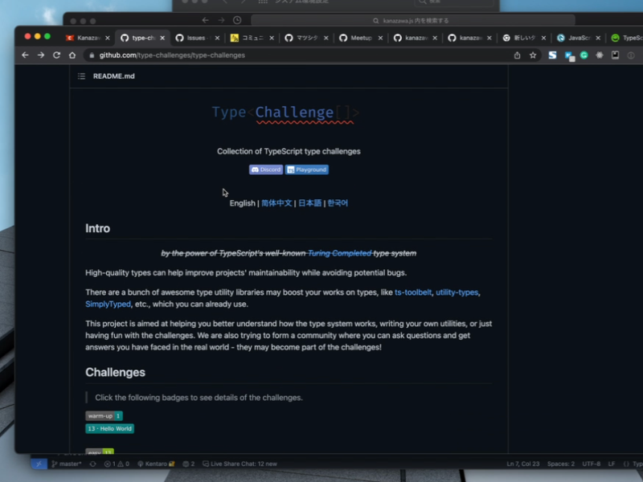
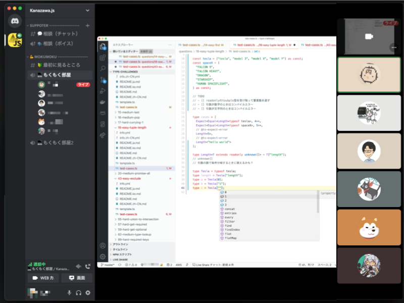
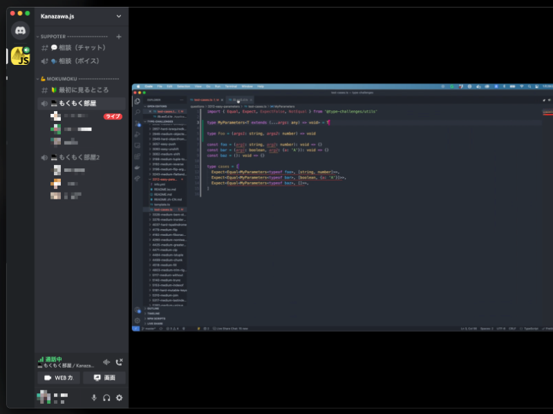
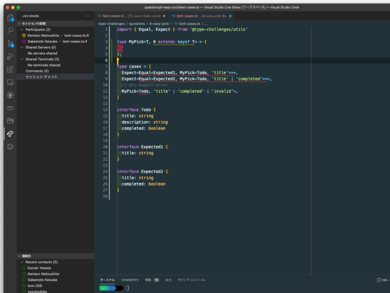
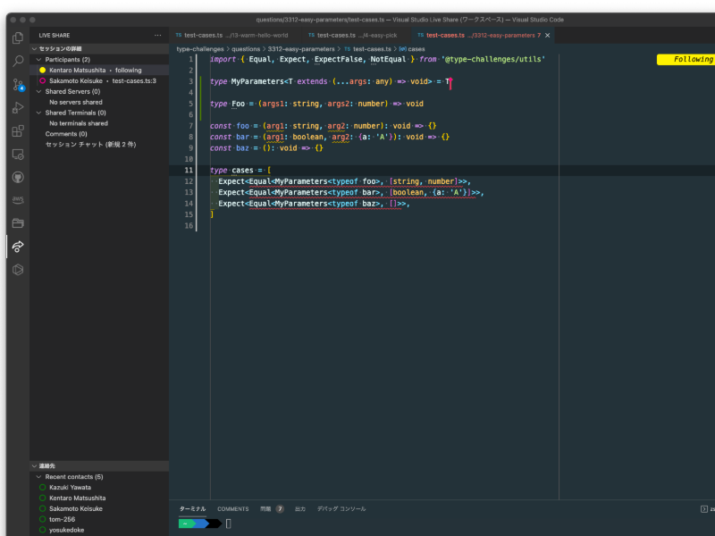

1月29日（土）に[Kanazawa.js もくもく会 #17 ~Type Challengeで"型"を学ぼう会~](https://kanazawajs.connpass.com/event/231583/)を実施しました！

#### イベント中の様子

TypeScript経験が豊富な方からあまりない方まで6名の方に参加いただきました。

今回は参加者を2チームに満遍なく分割して「Type Challenge」から好きな問題を選び、各々やりやすい形でモブプロしていくスタイルで実施しました。

代表者1名にホストになってもらい、VSCodeのLiveShereを利用したモブプロを行っての「Type Challenge」への挑戦（笑）

普段コードを書いている範疇では、あまり利用しない関数がちょこちょこ出てきていたため、各々「なんだこれ？」と言いながらググったり、   
Type Challengeの答えを見て「なぜこの回答で解けているのか？」という意見交換を参加者間で行われる姿が見られました。

今回はあくまで型パズルを解く内容がメインだった、普段TypeScriptを書く際に意識する内容とは異なる観点で各自問題を解いていましたが、
難易度easyでも難しい問題が多く、とてもTypeScript力が求められる・・・」という感想がちらほら出ていました。

